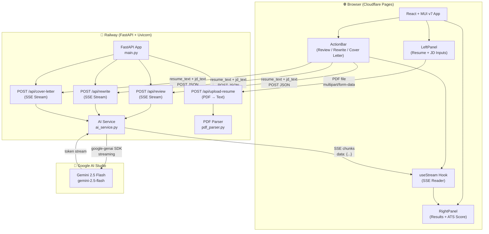
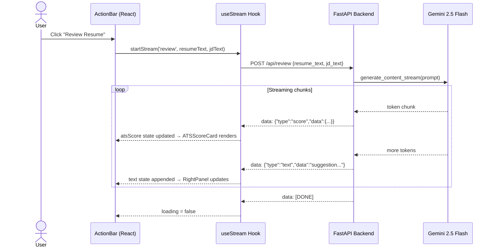
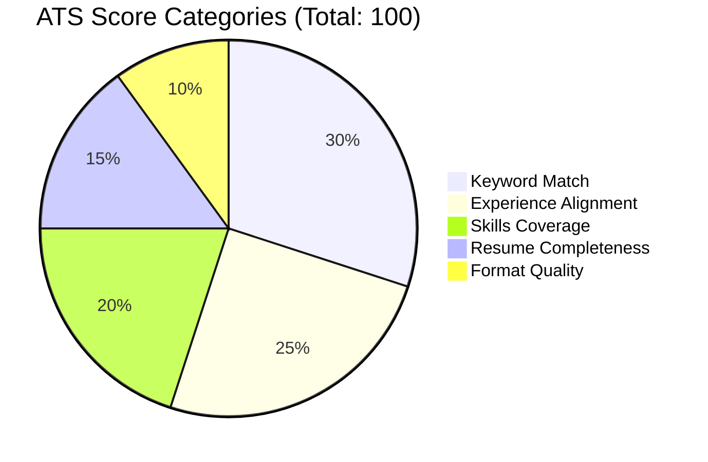
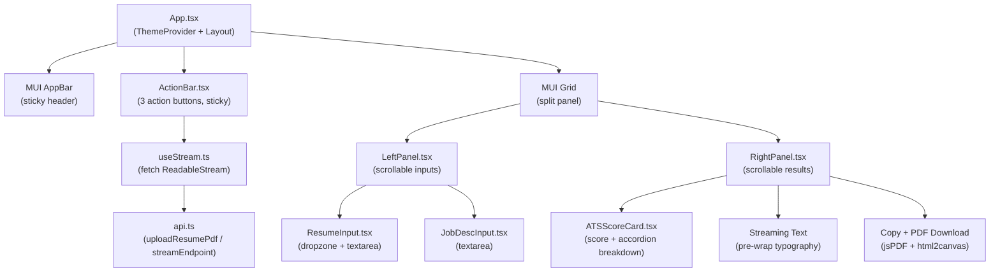

# AI Career Coach

An AI-powered career coaching web application that helps candidates optimize their job applications.
Upload a resume and job description to get an ATS-scored review, a tailored resume rewrite, or a
personalized cover letter — all streaming in real-time.

---

## Features

| Feature | Description |
|---------|-------------|
| **Resume Review** | ATS score (0–100) with category breakdown + prioritized improvement suggestions |
| **Resume Rewrite** | Full resume rewritten and optimized for the target job description |
| **Cover Letter** | Personalized, role-specific cover letter generated from resume + JD |
| **PDF Upload** | Drag-and-drop PDF upload with server-side text extraction |
| **Real-time Streaming** | AI output streams word-by-word via Server-Sent Events |
| **Download & Copy** | Export results as PDF or copy to clipboard |
| **Responsive UI** | Works on desktop (split-panel) and mobile (stacked) |

---

## System Architecture



---

## Data Flow — SSE Streaming



---

## ATS Score Breakdown



---

## Frontend Component Tree



---

## Tech Stack

### Backend
| Technology | Purpose |
|-----------|---------|
| **Python 3.12** | Runtime |
| **FastAPI** | REST API framework |
| **Uvicorn** | ASGI server |
| **google-genai** | Gemini 2.5 Flash SDK |
| **pdfplumber** | PDF text extraction |
| **StreamingResponse** | Server-Sent Events (SSE) |

### Frontend
| Technology | Purpose |
|-----------|---------|
| **React 19** | UI framework |
| **TypeScript** | Type safety |
| **Vite 7** | Build tool |
| **MUI v7** | Component library |
| **react-dropzone** | PDF drag-and-drop upload |
| **jsPDF + html2canvas** | Client-side PDF download |

### AI & Infrastructure
| Service | Purpose | Cost |
|---------|---------|------|
| **Google Gemini 2.5 Flash** | AI model (review, rewrite, cover letter) | Free (250 req/day) |
| **Cloudflare Pages** | Frontend hosting | Free |
| **Railway** | Backend hosting | ~$2–5/month |

---

## Project Structure

```
Career_Coach/
├── backend/
│   ├── main.py                 # FastAPI app entry point, CORS
│   ├── requirements.txt        # Python dependencies
│   ├── Dockerfile              # Railway deployment
│   ├── railway.toml            # Railway config
│   ├── .env.example            # Environment variable template
│   ├── routers/
│   │   ├── resume.py           # /api/upload-resume, /api/review, /api/rewrite
│   │   └── cover_letter.py     # /api/cover-letter
│   └── services/
│       ├── ai_service.py       # Gemini streaming (prompts + SSE generator)
│       └── pdf_parser.py       # pdfplumber PDF → text
└── frontend/
    ├── package.json
    ├── vite.config.ts          # Dev proxy → localhost:8000
    ├── .env.example            # VITE_API_URL template
    └── src/
        ├── App.tsx             # Root layout, MUI theme
        ├── components/
        │   ├── ActionBar.tsx   # Sticky 3-button action bar
        │   ├── LeftPanel.tsx   # Resume + JD inputs (scrollable)
        │   ├── ResumeInput.tsx # PDF drop zone + text paste
        │   ├── JobDescInput.tsx# JD textarea
        │   ├── RightPanel.tsx  # Results: score + streaming text
        │   └── ATSScoreCard.tsx# Score visualization (progress + accordion)
        ├── hooks/
        │   └── useStream.ts    # SSE fetch → state updates
        └── services/
            └── api.ts          # uploadResumePdf, streamEndpoint
```

---

## Getting Started (Local Development)

### Prerequisites
- Python 3.12+
- Node.js 18+
- A free [Google AI Studio](https://aistudio.google.com) API key

### 1. Backend

```bash
cd backend

# Create virtual environment
python3 -m venv venv
source venv/bin/activate          # Windows: venv\Scripts\activate

# Install dependencies
pip install -r requirements.txt

# Configure environment
cp .env.example .env
# Edit .env and set: GEMINI_API_KEY=your_key_here

# Start server
uvicorn main:app --reload
# API available at http://localhost:8000
# Docs at http://localhost:8000/docs
```

### 2. Frontend

```bash
cd frontend

# Install dependencies
npm install

# Start dev server (proxies /api → localhost:8000)
npm run dev
# App available at http://localhost:5173
```

---

## API Reference

| Endpoint | Method | Description |
|----------|--------|-------------|
| `/api/upload-resume` | `POST` | Upload PDF → returns extracted text |
| `/api/review` | `POST` | Stream ATS score + suggestions |
| `/api/rewrite` | `POST` | Stream rewritten resume |
| `/api/cover-letter` | `POST` | Stream cover letter |
| `/health` | `GET` | Health check |

### Request body (review / rewrite / cover-letter)
```json
{
  "resume_text": "Full text of the candidate's resume...",
  "jd_text": "Full text of the job description..."
}
```

### SSE Response format
```
data: {"type": "score", "data": {"total_score": 82, "breakdown": {...}}}

data: {"type": "text", "data": "1. Add quantified metrics to your experience..."}

data: [DONE]
```

---

## Deployment

### Backend → Railway

1. Push this repo to GitHub
2. Create a new Railway project → **Deploy from GitHub repo**
3. Set environment variable: `GEMINI_API_KEY=your_key`
4. Railway auto-detects `Dockerfile` and deploys
5. Note the Railway service URL (e.g. `https://career-coach-xxx.up.railway.app`)

### Frontend → Cloudflare Pages

1. Go to [Cloudflare Pages](https://pages.cloudflare.com) → **Create application**
2. Connect your GitHub repo
3. Set build settings:
   - **Build command**: `cd frontend && npm install && npm run build`
   - **Build output directory**: `frontend/dist`
4. Add environment variable: `VITE_API_URL=https://your-railway-url.up.railway.app`
5. Deploy — Cloudflare assigns a `*.pages.dev` URL

---

## Environment Variables

### Backend (`backend/.env`)
| Variable | Description |
|----------|-------------|
| `GEMINI_API_KEY` | Google AI Studio API key (free at [aistudio.google.com](https://aistudio.google.com)) |

### Frontend (`frontend/.env`)
| Variable | Description |
|----------|-------------|
| `VITE_API_URL` | Backend URL for production (leave empty for local dev) |

---

## License

MIT
